Plastic Pollution
================
Zarina
24/05/2022

# Motivation

Plastic pollution is a major and growing problem, negatively affecting
oceans and wildlife health. [Our World in
Data](https://ourworldindata.org/plastic-pollution) has a lot of great
data at various levels including globally, per country, and over time.
This report will explore the distributions of plastic waste and
mismanaged plastic waste generated per capita per day globally using
data from 2016 obtained from a recent
[article](https://www.science.org/doi/10.1126/sciadv.abd0288). The data
contain information on two different types of plastic waste generated by
the populations in 211 countries as well as other variables such as
income status, region, general population size,urban and coastal
population size, as well as GDP value per capita.

# Loading Data

``` r
load("~/Downloads/DS Durham/Data Visualization/Datasets/plastic.Rda")
head(plastic)
```

    ##            Country Code                     Region        GDP IncomeStatus
    ## AFG    Afghanistan  AFG                 South Asia   509.2187          LIC
    ## ALB        Albania  ALB      Europe & Central Asia  4124.0557          UMC
    ## DZA        Algeria  DZA Middle East & North Africa  3945.4821          UMC
    ## ASM American Samoa  ASM        East Asia & Pacific 11696.9556          UMC
    ## AND        Andorra  AND      Europe & Central Asia 37474.6654          HIC
    ## AGO         Angola  AGO         Sub-Saharan Africa  3506.0729          LMC
    ##     Population CoastalPopPC UrbanPopPC PlasticWaste MismanagedPW
    ## AFG   35383128         0.00      25.02        11.45           NA
    ## ALB    2876101         7.07      58.42        39.32           NA
    ## DZA   40551404         0.76      71.46        51.59         1.03
    ## ASM      55741         3.27      87.20        43.61           NA
    ## AND      77297         0.00      88.25        63.73        31.80
    ## AGO   28842484         1.44      64.15        22.60           NA

``` r
names(plastic)
```

    ##  [1] "Country"      "Code"         "Region"       "GDP"          "IncomeStatus"
    ##  [6] "Population"   "CoastalPopPC" "UrbanPopPC"   "PlasticWaste" "MismanagedPW"

``` r
str(plastic)
```

    ## 'data.frame':    211 obs. of  10 variables:
    ##  $ Country     : chr  "Afghanistan" "Albania" "Algeria" "American Samoa" ...
    ##  $ Code        : Factor w/ 211 levels "ABW","AFG","AGO",..: 2 4 54 9 5 3 10 7 8 1 ...
    ##  $ Region      : Factor w/ 7 levels "East Asia & Pacific",..: 6 2 4 1 2 7 3 3 2 3 ...
    ##  $ GDP         : num  509 4124 3945 11697 37475 ...
    ##  $ IncomeStatus: Factor w/ 4 levels "LIC","LMC","UMC",..: 1 3 3 3 4 2 4 4 3 4 ...
    ##  $ Population  : num  35383128 2876101 40551404 55741 77297 ...
    ##  $ CoastalPopPC: num  0 7.07 0.76 3.27 0 ...
    ##  $ UrbanPopPC  : num  25 58.4 71.5 87.2 88.2 ...
    ##  $ PlasticWaste: num  11.4 39.3 51.6 43.6 63.7 ...
    ##  $ MismanagedPW: num  NA NA 1.03 NA 31.8 ...

``` r
# rename income status level for an easier analysis
levels(plastic$IncomeStatus) <- c("Low", "Low-middle", "High-middle", "High")
```

# Data Exploration

``` r
# install.packages('skimr')
library(skimr)
skim(plastic)
```

|                                                  |         |
|:-------------------------------------------------|:--------|
| Name                                             | plastic |
| Number of rows                                   | 211     |
| Number of columns                                | 10      |
| \_\_\_\_\_\_\_\_\_\_\_\_\_\_\_\_\_\_\_\_\_\_\_   |         |
| Column type frequency:                           |         |
| character                                        | 1       |
| factor                                           | 3       |
| numeric                                          | 6       |
| \_\_\_\_\_\_\_\_\_\_\_\_\_\_\_\_\_\_\_\_\_\_\_\_ |         |
| Group variables                                  | None    |

Data summary

**Variable type: character**

| skim\_variable | n\_missing | complete\_rate | min | max | empty | n\_unique | whitespace |
|:---------------|-----------:|---------------:|----:|----:|------:|----------:|-----------:|
| Country        |          0 |              1 |   4 |  30 |     0 |       211 |          0 |

**Variable type: factor**

| skim\_variable | n\_missing | complete\_rate | ordered | n\_unique | top\_counts                        |
|:---------------|-----------:|---------------:|:--------|----------:|:-----------------------------------|
| Code           |          0 |              1 | FALSE   |       211 | ABW: 1, AFG: 1, AGO: 1, ALB: 1     |
| Region         |          0 |              1 | FALSE   |         7 | Eur: 55, Sub: 47, Lat: 42, Eas: 36 |
| IncomeStatus   |          0 |              1 | FALSE   |         4 | Hig: 78, Hig: 56, Low: 44, Low: 33 |

**Variable type: numeric**

| skim\_variable | n\_missing | complete\_rate |        mean |            sd |       p0 |       p25 |        p50 |         p75 |         p100 | hist  |
|:---------------|-----------:|---------------:|------------:|--------------:|---------:|----------:|-----------:|------------:|-------------:|:------|
| GDP            |          0 |           1.00 |    16496.91 |      25010.08 |     0.00 |   2053.79 |    5870.78 |    19717.33 | 1.700287e+05 | ▇▁▁▁▁ |
| Population     |          0 |           1.00 | 34921473.92 | 136312697\.76 | 11225.00 | 833995.50 | 6711121.00 | 23874626.50 | 1.378665e+09 | ▇▁▁▁▁ |
| CoastalPopPC   |          0 |           1.00 |        6.10 |         10.40 |     0.00 |      0.33 |       2.50 |        6.28 | 5.851000e+01 | ▇▁▁▁▁ |
| UrbanPopPC     |          0 |           1.00 |       59.60 |         24.68 |     0.00 |     40.84 |      60.18 |       79.71 | 1.000000e+02 | ▂▅▇▇▇ |
| PlasticWaste   |          2 |           0.99 |       46.00 |         44.30 |     1.49 |     15.67 |      31.60 |       58.66 | 3.082500e+02 | ▇▂▁▁▁ |
| MismanagedPW   |         41 |           0.81 |       17.42 |         25.66 |     0.14 |      3.13 |      10.09 |       19.39 | 1.430000e+02 | ▇▁▁▁▁ |

## Missing Data Analysis

The data has one pattern of missingness in the mismanaged plastic waste
variable, and two patterns of missingness in both types of plastic
waste. Notably, there are 41 missing cases in the mismanaged plastic
waste alone and two missing cases in the plastic waste. Around 56% of
the total missingness in the mismanaged plastic waste is attributed to
Sub-Saharan Africa.

``` r
# install.packages('mice', 'VIM')
library(mice)
```

    ## 
    ## Attaching package: 'mice'

    ## The following object is masked from 'package:stats':
    ## 
    ##     filter

    ## The following objects are masked from 'package:base':
    ## 
    ##     cbind, rbind

``` r
library(VIM)
```

    ## Loading required package: colorspace

    ## Loading required package: grid

    ## VIM is ready to use.

    ## Suggestions and bug-reports can be submitted at: https://github.com/statistikat/VIM/issues

    ## 
    ## Attaching package: 'VIM'

    ## The following object is masked from 'package:datasets':
    ## 
    ##     sleep

``` r
## first row: 170 complete cases
## second row:there are 39 patterns with only 1 missing value, which is mismanaged plastic waste
## third row: there are 2 patterns with 2 missing values, which are plastic waste and mismanaged plastic waste
## last row: there are 2 missing values in plastic waste and 41 missing values in mismanaged plastic waste
## overall, 43 observations are missing out of 211.

md.pairs(plastic)
```

    ## $rr
    ##              Country Code Region GDP IncomeStatus Population CoastalPopPC
    ## Country          211  211    211 211          211        211          211
    ## Code             211  211    211 211          211        211          211
    ## Region           211  211    211 211          211        211          211
    ## GDP              211  211    211 211          211        211          211
    ## IncomeStatus     211  211    211 211          211        211          211
    ## Population       211  211    211 211          211        211          211
    ## CoastalPopPC     211  211    211 211          211        211          211
    ## UrbanPopPC       211  211    211 211          211        211          211
    ## PlasticWaste     209  209    209 209          209        209          209
    ## MismanagedPW     170  170    170 170          170        170          170
    ##              UrbanPopPC PlasticWaste MismanagedPW
    ## Country             211          209          170
    ## Code                211          209          170
    ## Region              211          209          170
    ## GDP                 211          209          170
    ## IncomeStatus        211          209          170
    ## Population          211          209          170
    ## CoastalPopPC        211          209          170
    ## UrbanPopPC          211          209          170
    ## PlasticWaste        209          209          170
    ## MismanagedPW        170          170          170
    ## 
    ## $rm
    ##              Country Code Region GDP IncomeStatus Population CoastalPopPC
    ## Country            0    0      0   0            0          0            0
    ## Code               0    0      0   0            0          0            0
    ## Region             0    0      0   0            0          0            0
    ## GDP                0    0      0   0            0          0            0
    ## IncomeStatus       0    0      0   0            0          0            0
    ## Population         0    0      0   0            0          0            0
    ## CoastalPopPC       0    0      0   0            0          0            0
    ## UrbanPopPC         0    0      0   0            0          0            0
    ## PlasticWaste       0    0      0   0            0          0            0
    ## MismanagedPW       0    0      0   0            0          0            0
    ##              UrbanPopPC PlasticWaste MismanagedPW
    ## Country               0            2           41
    ## Code                  0            2           41
    ## Region                0            2           41
    ## GDP                   0            2           41
    ## IncomeStatus          0            2           41
    ## Population            0            2           41
    ## CoastalPopPC          0            2           41
    ## UrbanPopPC            0            2           41
    ## PlasticWaste          0            0           39
    ## MismanagedPW          0            0            0
    ## 
    ## $mr
    ##              Country Code Region GDP IncomeStatus Population CoastalPopPC
    ## Country            0    0      0   0            0          0            0
    ## Code               0    0      0   0            0          0            0
    ## Region             0    0      0   0            0          0            0
    ## GDP                0    0      0   0            0          0            0
    ## IncomeStatus       0    0      0   0            0          0            0
    ## Population         0    0      0   0            0          0            0
    ## CoastalPopPC       0    0      0   0            0          0            0
    ## UrbanPopPC         0    0      0   0            0          0            0
    ## PlasticWaste       2    2      2   2            2          2            2
    ## MismanagedPW      41   41     41  41           41         41           41
    ##              UrbanPopPC PlasticWaste MismanagedPW
    ## Country               0            0            0
    ## Code                  0            0            0
    ## Region                0            0            0
    ## GDP                   0            0            0
    ## IncomeStatus          0            0            0
    ## Population            0            0            0
    ## CoastalPopPC          0            0            0
    ## UrbanPopPC            0            0            0
    ## PlasticWaste          2            0            0
    ## MismanagedPW         41           39            0
    ## 
    ## $mm
    ##              Country Code Region GDP IncomeStatus Population CoastalPopPC
    ## Country            0    0      0   0            0          0            0
    ## Code               0    0      0   0            0          0            0
    ## Region             0    0      0   0            0          0            0
    ## GDP                0    0      0   0            0          0            0
    ## IncomeStatus       0    0      0   0            0          0            0
    ## Population         0    0      0   0            0          0            0
    ## CoastalPopPC       0    0      0   0            0          0            0
    ## UrbanPopPC         0    0      0   0            0          0            0
    ## PlasticWaste       0    0      0   0            0          0            0
    ## MismanagedPW       0    0      0   0            0          0            0
    ##              UrbanPopPC PlasticWaste MismanagedPW
    ## Country               0            0            0
    ## Code                  0            0            0
    ## Region                0            0            0
    ## GDP                   0            0            0
    ## IncomeStatus          0            0            0
    ## Population            0            0            0
    ## CoastalPopPC          0            0            0
    ## UrbanPopPC            0            0            0
    ## PlasticWaste          0            2            2
    ## MismanagedPW          0            2           41

``` r
aggr(plastic, col = mdc(1:2), numbers = TRUE,
     sortVars = TRUE, labels = names(plastic),
     cex.lab = .7,
     cex.axis = .6, gap = 2, ylab = c("Proportion of missingness","Missingness Pattern"))
```

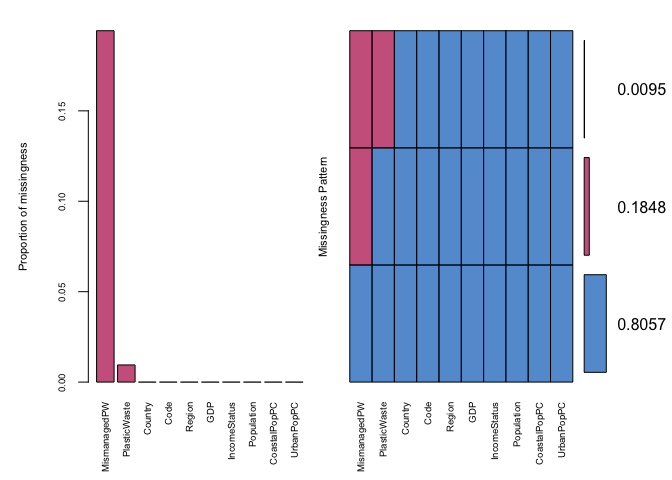<!-- -->

    ## 
    ##  Variables sorted by number of missings: 
    ##      Variable       Count
    ##  MismanagedPW 0.194312796
    ##  PlasticWaste 0.009478673
    ##       Country 0.000000000
    ##          Code 0.000000000
    ##        Region 0.000000000
    ##           GDP 0.000000000
    ##  IncomeStatus 0.000000000
    ##    Population 0.000000000
    ##  CoastalPopPC 0.000000000
    ##    UrbanPopPC 0.000000000

``` r
## so, we have only two missingness pattern, with the highest proportion of missingness correspond to mismanaged PW
marginplot(plastic[, c("MismanagedPW", "PlasticWaste")],
           col = mdc(1:2),
           cex.numbers = 1.2, pch = 19, xlab = "Mismanaged Plastic Waste per capita",
           ylab = "Plastic Waste per capita")
```

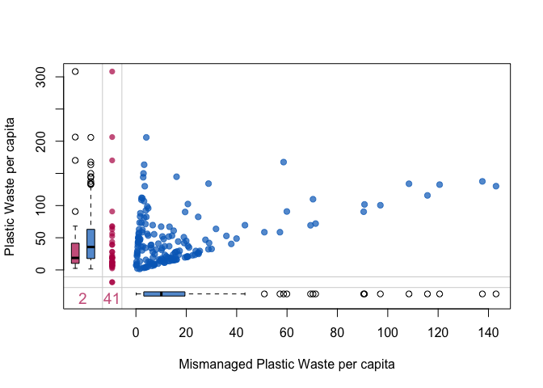<!-- -->

We can check the missing cases as shown below:

``` r
x <- plastic[!complete.cases(plastic),  ] # lots of missing values for mismanaged PW

xtabs(~Region, data = x) # most of these from Sub Saharan Africa (23), East Asia & Pacific, Latin America 
```

    ## Region
    ##        East Asia & Pacific      Europe & Central Asia 
    ##                          7                          2 
    ##  Latin America & Caribbean Middle East & North Africa 
    ##                          6                          2 
    ##              North America                 South Asia 
    ##                          0                          1 
    ##         Sub-Saharan Africa 
    ##                         23

``` r
xtabs(~IncomeStatus, data = x) # very high missing values from low and low-middle income (26)
```

    ## IncomeStatus
    ##         Low  Low-middle High-middle        High 
    ##          15          11           7           8

## Correlation plot

A correlation plot is obtained to explore the relationships between the
two types of plastic waste and other variables in the plastic dataset.

``` r
# remove missing values first to calculate correlation manually
data <- na.omit(plastic)
round(cor(data[, c(4, 6, 7, 8, 9, 10)]), 2)
```

    ##                GDP Population CoastalPopPC UrbanPopPC PlasticWaste MismanagedPW
    ## GDP           1.00      -0.09         0.16       0.44         0.43        -0.05
    ## Population   -0.09       1.00        -0.04      -0.08        -0.11        -0.06
    ## CoastalPopPC  0.16      -0.04         1.00       0.15         0.02         0.03
    ## UrbanPopPC    0.44      -0.08         0.15       1.00         0.38         0.02
    ## PlasticWaste  0.43      -0.11         0.02       0.38         1.00         0.42
    ## MismanagedPW -0.05      -0.06         0.03       0.02         0.42         1.00

``` r
# or using corrplot package
# install.packages ('corrplot', 'RColorBrewer')

library(corrplot)
```

    ## corrplot 0.92 loaded

``` r
library(RColorBrewer)
# mat : is a matrix of data
# ... : further arguments to pass to the native R cor.test function
cor.mtest <- function(mat, ...) {
  mat <- as.matrix(mat)
  n <- ncol(mat)
  p.mat<- matrix(NA, n, n)
  diag(p.mat) <- 0
  for (i in 1:(n - 1)) {
    for (j in (i + 1):n) {
      tmp <- cor.test(mat[, i], mat[, j], ...)
      p.mat[i, j] <- p.mat[j, i] <- tmp$p.value
    }
  }
  colnames(p.mat) <- rownames(p.mat) <- colnames(mat)
  p.mat
}

# matrix of the p-value of the correlation
p.mat <- cor.mtest(data[, c(4, 6, 7, 8, 9, 10)])
head(p.mat[, 1:5])
```

    ##                       GDP Population CoastalPopPC   UrbanPopPC PlasticWaste
    ## GDP          0.000000e+00  0.2599869   0.03318203 1.468796e-09 3.611139e-09
    ## Population   2.599869e-01  0.0000000   0.64693272 2.968781e-01 1.546294e-01
    ## CoastalPopPC 3.318203e-02  0.6469327   0.00000000 4.679163e-02 7.620806e-01
    ## UrbanPopPC   1.468796e-09  0.2968781   0.04679163 0.000000e+00 4.550404e-07
    ## PlasticWaste 3.611139e-09  0.1546294   0.76208059 4.550404e-07 0.000000e+00
    ## MismanagedPW 4.959714e-01  0.4003487   0.66421522 7.999911e-01 9.764815e-09

``` r
corrplot(cor(data[, c(4, 6, 7, 8, 9, 10)]), tl.cex = 0.75, method = "color", type = "upper", order = "hclust", col = brewer.pal(n=8, name="RdYlBu"), tl.col = "red", tl.srt = 45, addCoef.col = "black",
         # Combine with significance
         p.mat = p.mat, sig.level = 0.01,
         # hide correlation coefficient on the principal diagonal
         diag=FALSE )
```

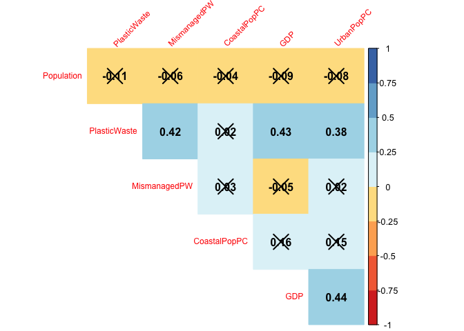<!-- -->

-   The correlation plot shows that *Plastic waste* has a relatively
    positive correlation with *Mismanaged plastic waste* (0.42), meaning
    countries with high plastic waste will also have high mismanaged
    plastic waste generated per capita. However, the correlation is only
    considered to be moderate since some countries particularly those
    with high-income status also tend to have low mismanaged plastic
    waste generated per capita.

-   Besides that, plastic waste also positively correlates with *GDP*
    per capita (0.43) and *Urban population* (0.38), meaning countries
    with high GDP per capita and high rate of urbanization tend to have
    high plastic waste. This is unsurprising given that a rapid economic
    growth can influence a high influx of migrants into urban areas,
    which will further increase the production of plastic materials in
    order to support the rising demands from populations. This finding
    is supported by a positive correlation between GDP per capita and
    the urban population features (0.44). Therefore, it is safe to
    conclude that countries with high-income status typically have high
    GDP per capita and urbanization rate, and consequently, high plastic
    waste per capita per day.

-   Apart from this, other associations do not appear to be significant
    and are relatively weak. For example, *Mismanaged plastic waste* has
    a very weak, negative association with *GDP* per capita (-0.05).
    This means that countries with high GDP per capita tend to have low
    mismanaged plastic waste. *Population* in general also has a weak,
    negative association with both types of plastic waste and other
    features in the data set. On the other hand, both *Urban* and
    *Coastal* populations have positive correlations with both types of
    plastic waste.

# Distribution of Plastic waste

``` r
## combined plots of histogram and boxplot of plastic waste
par(mfrow = c(2, 1))
hist(plastic$PlasticWaste,
     xlab = "Plastic waste per capita (kg/day)",
     col = "skyblue",
     breaks = 25,
     main = "Histogram of plastic waste")

boxplot(plastic$PlasticWaste,
        xlab = "Plastic waste per capita (kg/day)",
        col = 'skyblue',
        horizontal = TRUE,
        main = "Boxplot of plastic waste")
```

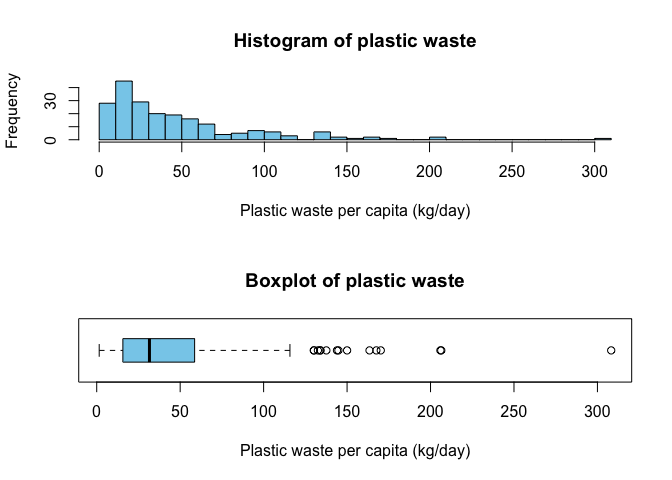<!-- -->

``` r
## Outliers/extreme values 

# outliers for PW
out <- boxplot.stats(plastic$PlasticWaste)$out
idx <- which(plastic$PlasticWaste %in% c(out))
plastic[idx, c('Country', 'Region', 'PlasticWaste')]
```

    ##                   Country                    Region PlasticWaste
    ## ABW                 Aruba Latin America & Caribbean       132.53
    ## BMU               Bermuda             North America       205.93
    ## CYM        Cayman Islands Latin America & Caribbean       133.86
    ## FRO        Faeroe Islands     Europe & Central Asia       167.53
    ## HKG  Hong Kong SAR, China       East Asia & Pacific       163.45
    ## ISL               Iceland     Europe & Central Asia       144.80
    ## FSM Micronesia, Fed. Sts.       East Asia & Pacific       308.25
    ## MDA               Moldova     Europe & Central Asia       130.15
    ## MNG              Mongolia       East Asia & Pacific       137.58
    ## PLW                 Palau       East Asia & Pacific       170.19
    ## PRI           Puerto Rico Latin America & Caribbean       134.10
    ## SGP             Singapore       East Asia & Pacific       143.96
    ## KNA   St. Kitts and Nevis Latin America & Caribbean       150.01
    ## USA         United States             North America       130.09
    ## VIR Virgin Islands (U.S.) Latin America & Caribbean       206.43

-   The histogram and boxplot show that the distribution of *Plastic
    waste* generated per capita is very heavily skewed to the right,
    with extreme outliers from 125 kilograms of plastic waste per
    capita. A very high peak is seen at approximately 25 kilograms of
    plastic waste per capita with a density of 0.023. A gap between 250
    kilograms and 300 kilograms of plastic waste is also seen,
    corresponding to two missing values in the Turks and Caicos Islands
    and Sint Maarten (Dutch part). It is worth noting that the data is
    somewhat polarizing with either low or high levels of plastic waste
    generated per capita, suggesting that underlying factors may
    influence such different levels of plastic pollution. For example,
    initial investigation reveals that a large cluster of low levels of
    plastic waste generated (i.e., 0-55 kilograms per day) correspond to
    Sub-Saharan Africa region with 46 observations, followed by Europe
    and Central Asia with 33 observations, and East Asia and Pacific
    with 28 observations. The other cluster corresponds to the Middle
    East and North Africa, South Asia and North America.

-   The top extreme outlier seen on the boxplot at 308.25 kilograms of
    plastic waste generated suggests a country with the highest level of
    plastic waste: the Federated States of Micronesia, a low-middle
    income country with a relatively small population of 110215, of
    which 22.53% lives in the urban area, and 8.41% lives in the coastal
    area. The following outliers correspond to Bermuda and the Virgin
    Islands, shown as two overlapping outliers at around 205-206
    kilograms of plastic waste per day. Both are high-income countries
    with very high urban populations (i.e., 95.48% for the Virgin
    Islands and 100% for Bermuda) and small coastal populations (i.e.,
    5.44% for the Virgin Islands and 11.86% for Bermuda). Indeed,
    Bermuda has the highest 100% urbanization other than Singapore,
    China, Cayman Islands and Monaco (World Urbanization Prospects,
    2018).

-   Notably, there are also two clusters of outliers at approximately
    130-150 kilograms of plastic waste per capita and 163-170 kilograms
    of plastic waste per capita. These clusters all correspond to
    high-income countries such as the United States (130.09 kilograms
    per capita), Singapore (143.96 kilograms per capita), Faeroe Islands
    par(mfrow = c(2, 1))

-   (167.53 kilograms per capita), and Palau (170.19 kilograms per day)
    and two low-middle income countries such as Moldova (130.15
    kilograms per day) and Mongolia (137.58 kilograms per day). Most of
    the countries within these clusters have high urbanization rates
    except for the aforementioned low-middle income countries and island
    countries such as Faeroe Islands and St. Kitts and Nevis.

# Distributions of Mismanaged Plastic Waste

``` r
par(mfrow = c(2, 1))
hist(plastic$MismanagedPW,
     xlab = "Mismanaged plastic waste per capita (kg/day)",
     breaks = 25,
     col = "thistle",
     main = "Histogram of mismanaged plastic")
boxplot(plastic$MismanagedPW,
        xlab = "Mismanaged plastic waste per capita (kg/day)",
        col = "thistle",
        horizontal = TRUE,
        main = "Boxplot of mismanaged plastic")
```

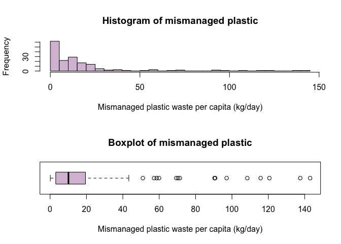<!-- -->

``` r
# outliers for mismanaged PW
out <- boxplot.stats(plastic$MismanagedPW)$out
idx <- which(plastic$MismanagedPW %in% c(out))
plastic[idx, c('Country', 'Region', 'MismanagedPW')]
```

    ##                      Country                     Region MismanagedPW
    ## ABW                    Aruba  Latin America & Caribbean       120.60
    ## CYM           Cayman Islands  Latin America & Caribbean       108.43
    ## FRO           Faeroe Islands      Europe & Central Asia        58.64
    ## KAZ               Kazakhstan      Europe & Central Asia        71.36
    ## KWT                   Kuwait Middle East & North Africa       115.77
    ## MDA                  Moldova      Europe & Central Asia       143.00
    ## MNG                 Mongolia        East Asia & Pacific       137.58
    ## MNE               Montenegro      Europe & Central Asia        97.07
    ## MNP Northern Mariana Islands        East Asia & Pacific        59.93
    ## OMN                     Oman Middle East & North Africa        90.44
    ## RUS       Russian Federation      Europe & Central Asia        57.19
    ## SLB          Solomon Islands        East Asia & Pacific        69.34
    ## TTO      Trinidad and Tobago  Latin America & Caribbean        90.77
    ## TUV                   Tuvalu        East Asia & Pacific        51.01
    ## ARE     United Arab Emirates Middle East & North Africa        70.32

-   The histogram and boxplot show that the distribution of *Mismanaged
    plastic waste* per capita per day is very heavily skewed to the
    right, with extreme outliers from around 45 kilograms and above. A
    very high peak is seen around 10 kilograms with an approximate
    density of 0.073 - about three times higher than the density peak
    for plastic waste. Interestingly, this peak corresponds to
    high-middle- and high-income countries, which account for the
    highest proportions of the lowest mismanaged plastic waste. This
    initial observation may suggest that high-income countries have a
    good waste management system that influences a low level of
    mismanaged plastic waste, despite having a high level of plastic
    waste.

-   The boxplot shows a few clusters of outliers, corresponding to a mix
    of high, high-middle and low-middle income countries. For example,
    the two top extreme outliers correspond to two low-middle income
    countries: Mongolia (137.58 kilograms per capita) and Moldova (143
    kilograms per capita); both are also extreme outliers for plastic
    waste. The following outliers correspond to high-income countries
    with a 100% urbanization rate, such as the Cayman Islands (108.43
    kilograms per capita) and Kuwait (115.77 kilograms per capita) and
    Aruba (120.60 kilograms per day). This trend suggests that
    urbanization is also likely to affect mismanaged plastic waste per
    capita per day.

-   Surprisingly, low-income countries such as Guinea (3.11 kilograms
    per capita), Ethiopia (1.49 kilograms per capita), Nigeria (4.04
    kilograms per capita) and other low-middle income countries such as
    Bangladesh (4.69 kilograms per capita), Bhutan (0.54 kilograms per
    capita), and Cameroon (4.11 kilograms per capita) have a relatively
    low level of mismanaged plastic waste. It is also possible that
    these values may not reflect the accurate picture due to a high
    proportion of data missingness in low-income countries (i.e., 63.4%
    of the total missingness). Overall, initial explorations of the
    distributions of these two types of plastic waste suggest that
    different regions, countries’ income status levels, and urbanization
    likely affect plastic pollution.

# Distributions of plastic waste across regions

``` r
# install.packages('lattice', 'ggplot2', 'ggridges', 'ggpubr')
# Plastic waste split by regions
library(lattice)
histogram(~PlasticWaste|Region, data = plastic,
          xlab = "Plastic Waste (kg/day)")
```

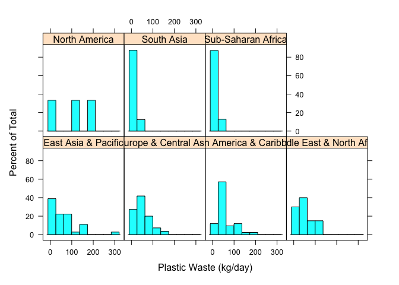<!-- -->

``` r
library(ggplot2)
library(ggridges)
library(ggpubr)

# ridge plot, boxplot, histograms by regions

# ridge plot
ggplot(plastic,aes(PlasticWaste, y = factor(Region),fill = Region))+
  geom_density_ridges(scale = 1.5) +
  labs(x = "Plastic waste per capita (kg/day)",
       y = "Region") + 
  ggtitle("Plastic waste by regions") +
    theme(plot.title = element_text(hjust = 0.5, face = "bold")) 
```

    ## Picking joint bandwidth of 16.9

    ## Warning: Removed 2 rows containing non-finite values (stat_density_ridges).

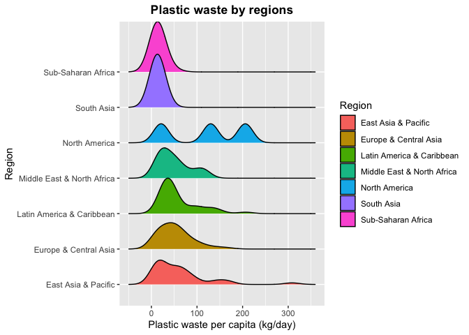<!-- -->

``` r
# boxplot
ggplot(plastic,aes(x = PlasticWaste, y = factor(Region))) +
geom_boxplot(aes(fill = factor(Region))) +
labs(y = "Region", x = "Plastic waste per capita (kg/day)") 
```

    ## Warning: Removed 2 rows containing non-finite values (stat_boxplot).

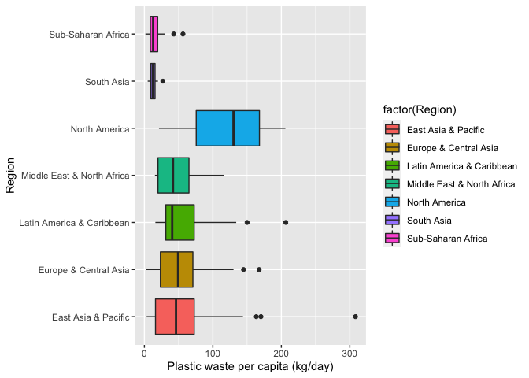<!-- -->

``` r
# outliers
# outliers in region 2

out <- boxplot.stats(plastic$PlasticWaste[plastic$Region == "Europe & Central Asia"])$out
idx <- which(plastic$PlasticWaste %in% c(out))
plastic[idx,]
```

    ##            Country Code                Region     GDP IncomeStatus Population
    ## FRO Faeroe Islands  FRO Europe & Central Asia 56854.1         High      48173
    ## ISL        Iceland  ISL Europe & Central Asia 61466.8         High     335439
    ##     CoastalPopPC UrbanPopPC PlasticWaste MismanagedPW
    ## FRO         6.77      41.78       167.53        58.64
    ## ISL         7.56      93.74       144.80        16.13

``` r
# outliers in region 3
out <- boxplot.stats(plastic$PlasticWaste[plastic$Region == "Latin America & Caribbean"])$out
idx <- which(plastic$PlasticWaste %in% c(out))
plastic[idx,]
```

    ##                   Country Code                    Region      GDP IncomeStatus
    ## KNA   St. Kitts and Nevis  KNA Latin America & Caribbean 18810.49         High
    ## VIR Virgin Islands (U.S.)  VIR Latin America & Caribbean 35931.54         High
    ##     Population CoastalPopPC UrbanPopPC PlasticWaste MismanagedPW
    ## KNA      51629         3.89      30.79       150.01            3
    ## VIR     107510         5.44      95.48       206.43           NA

``` r
# outliers in region 7
out <- boxplot.stats(plastic$PlasticWaste[plastic$Region == "Sub-Saharan Africa"])$out
idx <- which(plastic$PlasticWaste %in% c(out))
plastic[idx,]
```

    ##        Country Code             Region       GDP IncomeStatus Population
    ## MUS  Mauritius  MUS Sub-Saharan Africa  9681.619  High-middle    1263473
    ## SYC Seychelles  SYC Sub-Saharan Africa 15068.620         High      94677
    ##     CoastalPopPC UrbanPopPC PlasticWaste MismanagedPW
    ## MUS         1.41      40.91        42.94         0.86
    ## SYC        16.64      55.83        56.38           NA

``` r
#outliers in region 6
out <- boxplot.stats(plastic$PlasticWaste[plastic$Region == "South Asia"])$out
idx <- which(plastic$PlasticWaste %in% c(out))
plastic[idx,]
```

    ##  [1] Country      Code         Region       GDP          IncomeStatus
    ##  [6] Population   CoastalPopPC UrbanPopPC   PlasticWaste MismanagedPW
    ## <0 rows> (or 0-length row.names)

-   The plots above show the distributions of plastic waste generated
    per capita across different regions. The ridgeline plot shows that
    Sub-Saharan Africa and South Asia have a relatively similar peak at
    around 12.50 kilograms of plastic waste per capita. Thus,
    surprisingly, marking these two regions as having the lowest level
    of plastic waste generated per capita per day compared to the other
    regions.The density distribution for South Asia appears to be
    relatively normal, while the density distribution for Sub- Saharan
    Africa seems to be right-skewed.

-   On the other hand, North America has a trimodal distribution with
    three peaks observed at three different levels of plastic waste
    generated per capita. Initial exploration reveals that these peaks
    correspond to three countries within this region: Canada (21.32
    kilograms per capita), the United States (130.09 kilograms per
    capita) and Bermuda (205.93 kilograms per capita). Thus, this region
    has the largest volume of plastic waste generated, with a uniform
    distribution since all three peaks have almost the same height. The
    rest of the regions all have a relatively right-skewed distribution
    with a very similar peak between 42-50 kilograms of plastic waste
    generated per capita.

-   In addition, there are several outliers observed in most of the
    regions except for North America and the Middle East and North
    Africa. For example, the outliers in the East Asia and Pacific
    region correspond to Hong Kong, China (163.45 kilograms per capita),
    Palau (170.19 kilograms per capita) and Micronesia (308.25 kilograms
    per capita); in the Europe and Central Asia region, the outliers
    correspond to Iceland (144.80 kilograms per capita) and Faeroe
    Islands (144.80 kilograms per capita), in the Latin America and
    Caribbean region the outliers correspond to St. Kitts and Nevis
    (150.01 kilograms per capita) and Virgin Islands (206.43 kilograms
    per capita), in the Sub- Saharan Africa region the outliers
    correspond to Mauritius (42.94 kilograms per capita) and Seychelles
    (56.38 kilograms per capita). In South Asia, the outliers correspond
    to Bhutan (26.94 kilograms per capita).

# Distributions of Mismanaged plastic waste across regions

``` r
# lattice
histogram(~MismanagedPW|Region, data = plastic,
          xlab = "Mismanaged Plastic Waste (kg/day)")
```

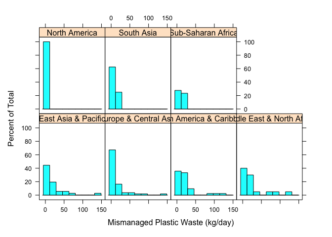<!-- -->

``` r
# ridge plot
ggplot(plastic,aes(MismanagedPW, y = factor(Region),fill = Region))+
  geom_density_ridges(scale = 1.5) +
  labs(x = "Mismanaged plastic waste per capita (kg/day)",
       y = "Region") + 
  ggtitle("Mismanaged plastic waste by regions") +
  theme(plot.title = element_text(hjust = 0.5, face = "bold"))
```

    ## Picking joint bandwidth of 4.47

    ## Warning: Removed 41 rows containing non-finite values (stat_density_ridges).

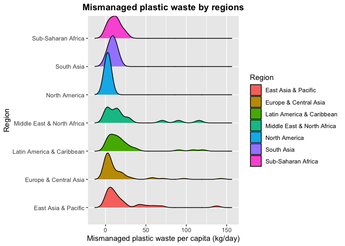<!-- -->

``` r
# boxplot
ggplot(plastic,aes(x = MismanagedPW, y = factor(Region))) +
  geom_boxplot(aes(fill = factor(Region))) +
  labs(y = "Region", x = "Mismanaged plastic waste per capita (kg/day)") 
```

    ## Warning: Removed 41 rows containing non-finite values (stat_boxplot).

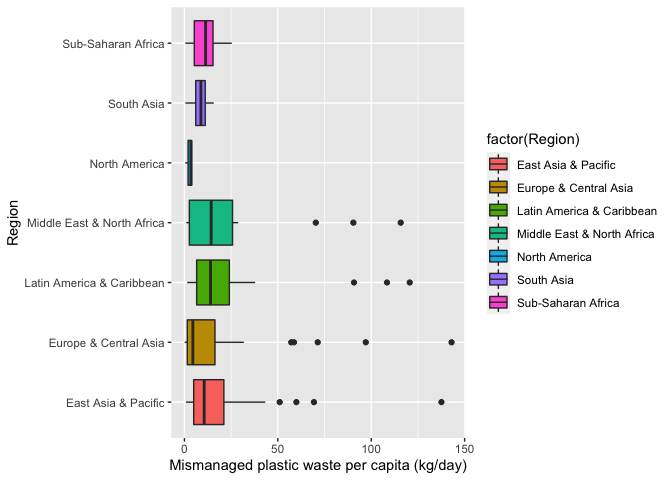<!-- -->

``` r
# outliers in region 1

out <- boxplot.stats(plastic$MismanagedPW[plastic$Region == "East Asia & Pacific"])$out
idx <- which(plastic$MismanagedPW %in% c(out))
plastic[idx,]
```

    ##                      Country Code              Region       GDP IncomeStatus
    ## MNG                 Mongolia  MNG East Asia & Pacific  3660.151   Low-middle
    ## MNP Northern Mariana Islands  MNP East Asia & Pacific 22246.743         High
    ## SLB          Solomon Islands  SLB East Asia & Pacific  2225.490   Low-middle
    ## TUV                   Tuvalu  TUV East Asia & Pacific  3255.929  High-middle
    ##     Population CoastalPopPC UrbanPopPC PlasticWaste MismanagedPW
    ## MNG    3056359         0.00      68.30       137.58       137.58
    ## MNP      56188         1.85      91.44        90.80        59.93
    ## SLB     619437         2.86      22.82        69.34        69.34
    ## TUV      11225        47.47      60.65        58.64        51.01

``` r
# outliers in region 2

out <- boxplot.stats(plastic$MismanagedPW[plastic$Region == "Europe & Central Asia"])$out
idx <- which(plastic$MismanagedPW%in% c(out))
plastic[idx,]
```

    ##                Country Code                Region       GDP IncomeStatus
    ## FRO     Faeroe Islands  FRO Europe & Central Asia 56854.103         High
    ## KAZ         Kazakhstan  KAZ Europe & Central Asia  7714.842  High-middle
    ## MDA            Moldova  MDA Europe & Central Asia  2880.439   Low-middle
    ## MNE         Montenegro  MNE Europe & Central Asia  7028.663  High-middle
    ## RUS Russian Federation  RUS Europe & Central Asia  8704.898  High-middle
    ##     Population CoastalPopPC UrbanPopPC PlasticWaste MismanagedPW
    ## FRO      48173         6.77      41.78       167.53        58.64
    ## KAZ   17794055         0.00      57.26        72.02        71.36
    ## MDA    2802170         0.59      42.51       130.15       143.00
    ## MNE     622303         0.00      66.14       100.50        97.07
    ## RUS  144342396         1.21      74.16        58.66        57.19

``` r
# outliers in region 3
out <- boxplot.stats(plastic$MismanagedPW[plastic$Region == "Latin America & Caribbean"])$out
idx <- which(plastic$MismanagedPW %in% c(out))
plastic[idx,]
```

    ##                 Country Code                    Region      GDP IncomeStatus
    ## ABW               Aruba  ABW Latin America & Caribbean 28281.35         High
    ## CYM      Cayman Islands  CYM Latin America & Caribbean 78465.36         High
    ## TTO Trinidad and Tobago  TTO Latin America & Caribbean 16176.95         High
    ##     Population CoastalPopPC UrbanPopPC PlasticWaste MismanagedPW
    ## ABW     104872         7.07      43.19       132.53       120.60
    ## CYM      62569        12.07     100.00       133.86       108.43
    ## TTO    1377564         2.91      53.25       101.75        90.77

``` r
# outliers in region 4
out <- boxplot.stats(plastic$MismanagedPW[plastic$Region == "Middle East & North Africa"])$out
idx <- which(plastic$MismanagedPW %in% c(out))
plastic[idx,]
```

    ##                  Country Code                     Region      GDP IncomeStatus
    ## KWT               Kuwait  KWT Middle East & North Africa 27653.07         High
    ## OMN                 Oman  OMN Middle East & North Africa 14618.73         High
    ## ARE United Arab Emirates  ARE Middle East & North Africa 38141.85         High
    ##     Population CoastalPopPC UrbanPopPC PlasticWaste MismanagedPW
    ## KWT    3956875        17.40     100.00       115.77       115.77
    ## OMN    4479219         5.65      82.50        90.44        90.44
    ## ARE    9360980        14.78      85.97       109.88        70.32

-   The plots above show the distributions of *Mismanaged plastic waste*
    generated per capita across regions. The distribution appears to be
    primarily right skewed, except for North America, with a relatively
    uniform distribution. South Asia, the Middle East, and North Africa
    have a relatively normal distribution. It turns out that North
    America has the lowest level of mismanaged plastic waste generated
    per capita with an average of 2.69 kilograms, despite having the
    highest level of plastic waste generated per capita, as shown
    previously in Figure 4. Within this region, Canada accounts for the
    lowest value of the mismanaged plastic waste generated (0.43
    kilograms per capita), followed by the United States (3.51 kilograms
    per capita) and Bermuda (4.12 kilograms per capita).

-   Similarly, Europe and Central Asia have a similar distribution peak
    to North America, possibly indicating that this region has good
    waste management infrastructures and systems that control the amount
    of plastic waste inadequately discarded in the surrounding
    environment. However, it is worth noting that its density
    distribution appears to be relatively right skewed as some other
    countries within this region have a high level of mismanaged plastic
    waste generated per capita. For example, Moldova (143.00 kilograms
    per capita), Kazakhstan (71.36 kilograms per capita) and Russia
    (97.07 kilograms per capita) as indicated by the outliers.

-   The Middle East and North Africa appear to have the highest level of
    mismanaged plastic waste generated per capita per day (5b), with an
    average of 24.63 kilograms. The density distribution appears to be
    normally distributed. However, there are three small peaks within
    this region corresponding to three outliers, which are identified as
    Oman (90.44 kilograms per capita), United Arab Emirates (109.88
    kilograms per capita) and Kuwait (115.77 kilograms per capita).
    These three countries turn out to be high-income countries.

-   Besides that, Latin America and the Caribbean has a similar average
    value of mismanaged plastic waste to the Middle East and North
    Africa, but with a very right- skewed distribution. The outliers
    within this region correspond to Trinidad and Tobago (90.77
    kilograms per capita), Cayman Islands (108.43 kilograms per capita),
    and Aruba (132.53 kilograms per capita).

-   South Asia and Sub-Saharan Africa also have a similar distribution
    peak at around 11.22 kilograms of mismanaged plastic waste generated
    per capita per day, which is relatively low. There are no outliers
    observed within these two regions. Meanwhile, in East Asia and the
    Pacific, there are several outliers observed corresponding to Tuvalu
    (51.01 kilograms per capita), Northern Marian Islands (59.93
    kilograms per capita), Solomon Islands (69.34 kilograms per capita),
    and Mongolia (137.58 kilograms per capita). *Overall, we see quite a
    difference between the mismanaged plastic waste generated and the
    plastic waste generated per capita across different regions*.
    Perhaps, other features such as income status may provide further
    interesting explanation for this difference.

# Distributions of plastic waste across income

``` r
# Plastic waste split by income status
histogram(~PlasticWaste|IncomeStatus, data = plastic,
          xlab = "Plastic Waste (kg/day)")
```

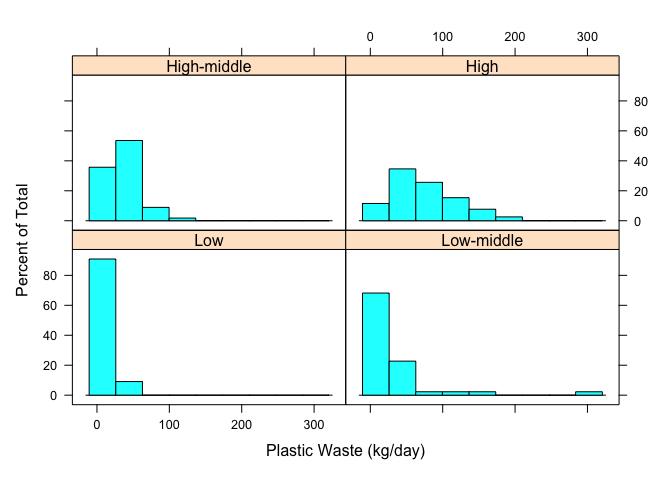<!-- -->

``` r
# violin plot
ggplot(plastic,
       aes(x = factor(IncomeStatus),
           y = PlasticWaste)) +
  geom_violin(aes(fill = IncomeStatus)) +
  labs(x = "Income Status", y = "Plastic waste per capita (kg/day)")+
  geom_boxplot(width = 0.08) + scale_fill_discrete(name = "Income Status") + 
  ggtitle("Plastic waste by income status") +
  theme(plot.title = element_text(face = "bold", hjust = 0.5),
        legend.position = "bottom")
```

    ## Warning: Removed 2 rows containing non-finite values (stat_ydensity).

    ## Warning: Removed 2 rows containing non-finite values (stat_boxplot).

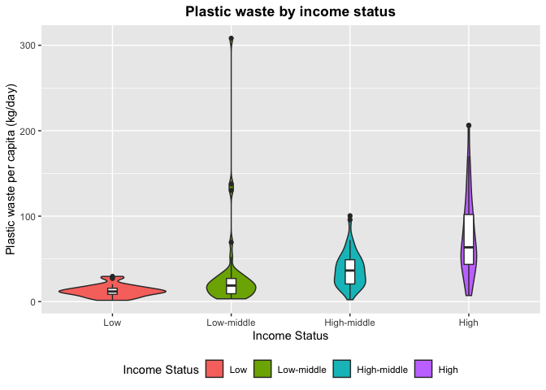<!-- -->

``` r
# histogram

ggplot(plastic,
      aes(PlasticWaste, fill = IncomeStatus
          )) +
  geom_histogram(binwidth = 5,
                 aes(y = ..density..),
                 colour = 1, fill = "white") + labs( x = "Plastic waste per capita (kg/day)")+
  facet_wrap(~IncomeStatus) + 
  geom_density(lwd = 0.4, colour = 4, fill = 4, alpha = 0.24)
```

    ## Warning: Removed 2 rows containing non-finite values (stat_bin).

    ## Warning: Removed 2 rows containing non-finite values (stat_density).

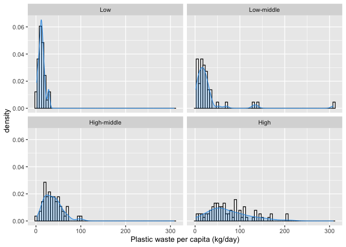<!-- -->

``` r
# ridge plot
ggplot(plastic,aes(PlasticWaste, y = factor(IncomeStatus),fill = IncomeStatus))+
  geom_density_ridges(scale = 1.5) +
  labs(x = "Plastic waste per capita (kg/day)",
       y = "Income Status") + 
  ggtitle("Ridgeline plot") +
  theme(plot.title = element_text(hjust = 0.5, face = "bold"),
        legend.position = "none")
```

    ## Picking joint bandwidth of 8.15

    ## Warning: Removed 2 rows containing non-finite values (stat_density_ridges).

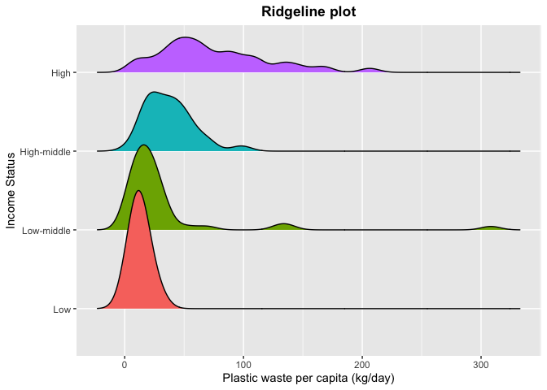<!-- -->

-   The plots above show the distribution of *plastic waste* generated
    per capita across countries of different income statuses. The
    boxplots inside the density curves suggest that high-income
    countries have the highest number of plastic wastes generated,
    followed by high-middle, low- middle, and low-income countries.
    There are also outliers observed within each category. For example,
    there are three overlapping outliers in the low-income category
    corresponding to Haiti (27.06 kilograms per capita), Rwanda (28.18
    kilograms per capita) and Zimbabwe (29.49 kilograms per capita). For
    low-middle income countries, the outliers correspond to Solomon
    Islands (69.34 kilograms per capita), Moldova (130.15 kilograms per
    capita), Mongolia (137.58 kilograms per capita) and Micronesia
    (308.25 kilograms per capita). For high-middle income countries, the
    outliers correspond to St. Lucia (95.76 kilograms per capita) and
    Montenegro (100.50 kilograms per capita). Lastly, for high-income
    countries, the outliers correspond to Bermuda (205.93 kilograms per
    capita) and the Virgin Islands (206.43 kilograms per capita).

-   In terms of the overall density distribution, the low and
    high-middle income countries appear to be normally distributed with
    distinct peaks at around 12.00 kilograms per capita and 36.00
    kilograms per capita, respectively. On the other hand, the
    low-middle- and high-income countries have a rather right-skewed
    distribution, with the latter having a much-elongated distribution
    with a lack of distinct peak. Nevertheless, there is a clear pattern
    of association between the income status and the plastic waste
    generated per capita, which may explain the previously seen
    differences across varying regions.

# Distributions of mismanaged plastic waste across income

``` r
# Mimanaged PW split by income status
histogram(~MismanagedPW|IncomeStatus, data = plastic,
          xlab = "Mismanaged Plastic Waste (kg/day)")
```

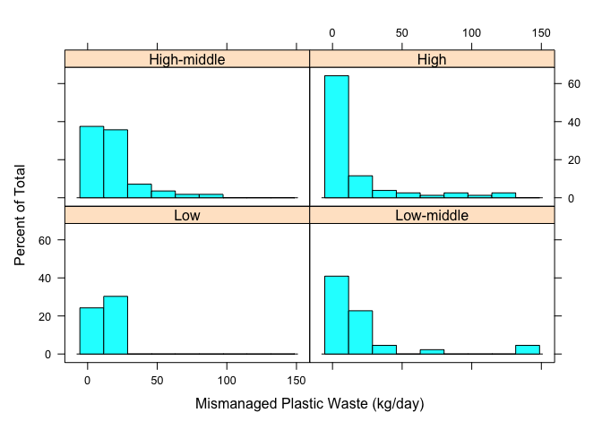<!-- -->

``` r
# violin plot
ggplot(plastic,
                  aes(x = factor(IncomeStatus),
                      y = MismanagedPW)) +
  geom_violin(aes(fill = IncomeStatus)) +
  labs(x = "Income Status", y = "Mismanaged plastic waste per capita (kg/day)")+
  geom_boxplot(width = 0.08) + scale_fill_discrete(name = "Income Status") + 
  ggtitle("Mismanaged plastic waste by income status") +
  theme(plot.title = element_text(face = "bold", hjust = 0.5),
        legend.position = "bottom")
```

    ## Warning: Removed 41 rows containing non-finite values (stat_ydensity).

    ## Warning: Removed 41 rows containing non-finite values (stat_boxplot).

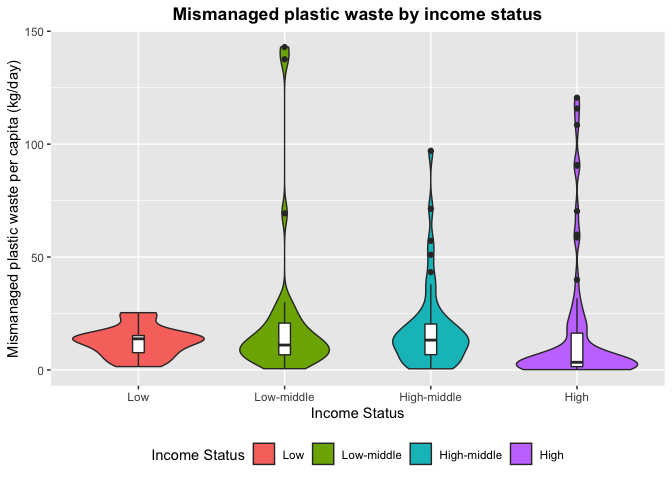<!-- -->

``` r
# ridge plot
ggplot(plastic,
       aes(MismanagedPW, y = factor(IncomeStatus),
           fill = IncomeStatus))+
  geom_density_ridges(scale = 1.5) +
  labs(x = "Mismanaged Plastic Waste (kg/day)",
       y = "Income Status")
```

    ## Picking joint bandwidth of 3.99

    ## Warning: Removed 41 rows containing non-finite values (stat_density_ridges).

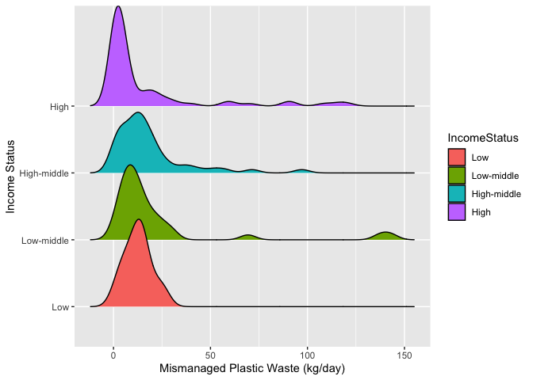<!-- -->

-   The plots above show the distribution of mismanaged plastic waste
    generated per capita across countries with different income
    statuses. In contrast to the previous finding, *high-income
    countries have the lowest mismanaged plastic waste generated,
    followed by the low-middle, high-middle, and low-income countries*.
    This trend suggests that high-income countries have good waste
    management systems and infrastructures to properly control the
    plastic waste from being discarded into the surrounding environment.

-   Most distributions appear to be relatively right-skewed with
    distinct peaks, except for the low-income countries with a rather
    left-skewed distribution. Several outliers are identified,
    especially in high and high-middle income countries, indicating that
    not all countries with the same income status have the same waste
    management systems and infrastructures. For example, Aruba (120.60
    kilograms per capita), Kuwait (115.00 kilograms per capita), and
    Cayman Islands (108.43 kilograms per capita) are the topmost extreme
    outliers in the high-income category. These countries also have high
    plastic waste generated. Nevertheless, it does appear that a
    high-income status positively contributes to the low level of
    mismanaged plastic waste generated per capita per day. Still, it
    also negatively contributes to the high level of plastic waste
    generated per capita per day.

# Relationships between other variables and plastic waste

-   Parallel coordinates plot can be used to show relationships between
    variables. The plot below shows the relationships between variables
    and different income status is highlighted in distinct colours for
    comparison.

-   Indeed, the purple lines corresponding to high-income countries tend
    to form the top layers of observations on each feature, meaning that
    those countries tend to dominate in terms of the GDP per capita,
    urbanization and plastic waste.

-   On the other hand, the blue and green lines corresponding to the
    low-middle and high-middle income countries, respectively, tend to
    follow a similar pattern to those seen in high-income countries.
    However, the only difference is that the mismanaged plastic waste
    tends to be higher than the plastic waste generated per capita.

-   In addition, there are two striking blue and green points on the
    population axis, which turn out to be two outliers corresponding to
    a high-middle income country, China, and a low-middle income
    country, India, with a very high number of populations. Lastly, the
    low-income countries represented as the orange lines tend to form
    the bottommost layer of the parallel coordinates plot, meaning these
    countries have low values on these features.

``` r
library(MASS)
library(GGally)
```

    ## Registered S3 method overwritten by 'GGally':
    ##   method from   
    ##   +.gg   ggplot2

``` r
## vector colour
library(RColorBrewer)
palette <- brewer.pal(4, "Set1")
my_colors <- palette[as.numeric(plastic$IncomeStatus)]

levels(plastic$IncomeStatus) <- c("Low", "Low-middle", "High-middle", "High")
ggparcoord(plastic,
           columns = c(4, 6, 7, 8, 9, 10),
           groupColumn = 5,
           showPoints = TRUE,
           scale = "uniminmax",
           missing = "exclude",
           title = "Parallel coordinates of plastic data by income group",
           alphaLines = 0.4) +
  theme(
    plot.title = element_text(size=10, face = "bold"),
    legend.position = "bottom") +scale_shape_discrete(name = "Income")
```

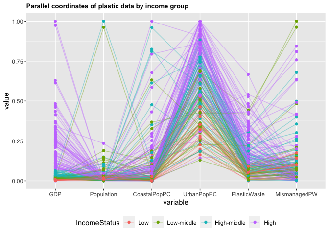<!-- -->

# GDP and mismanaged/plastic waste

The interaction between GDP and the two types of plastic waste entails
an interesting feature.

``` r
lfit <- loess(PlasticWaste ~ GDP, data=plastic, span=0.66)
## create a sequence of points to cover the x-axis
xs <- seq(min(plastic$GDP), max(plastic$GDP), length=200)
## get the predicted trend at the new locations, and the error too
lpred <- predict(lfit, data.frame(GDP=xs), se = TRUE) 
plot(plastic$GDP,
     plastic$PlasticWaste,
     xlab = "GDP per capita",
     ylab =  "Plastic waste per capita (kg/day)",
     main = "Plastic waste vs GDP",
     pch =16)
## add the loess prediction
lines(x=xs, y=lpred$fit, col='red',lwd=4) 

##  loess curve is much smoother and better behaved, however it is still influenced by the outliers in the data

## EXTRACT CI
upr <- lpred$fit + 1.96*lpred$se.fit
lwr <- lpred$fit - 1.96*lpred$se.fit
lines(x=xs, y=lpred$fit,col='red',lwd=4)
lines(x=xs, y=upr,col='red',lwd=1, lty=2)
lines(x=xs, y=lwr,col='red',lwd=1, lty=2)

## These confidence intervals are intervals for the location of the trend, not for the data. We do not expect most of our data to be between these limits.
## Notice how our uncertainty grows to the right of the plot where we have fewest data.

## USE POLYGONS

## we need 'scales' to use the alpha function for transparency
library(scales) 
polygon(x=c(xs,rev(xs)), 
        y=c(upr,rev(lwr)),
        col=alpha('red',0.2), border=NA)
```

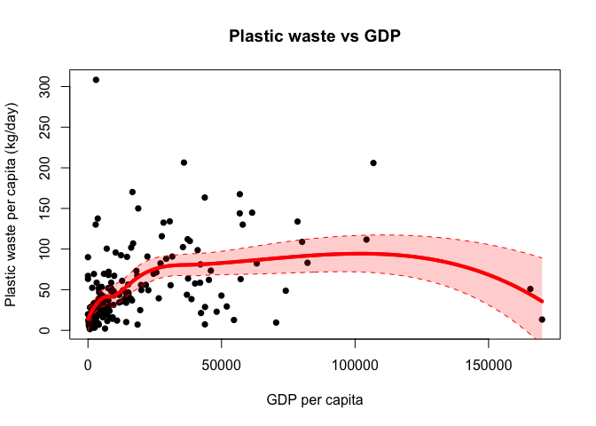<!-- -->

``` r
# mismanaged pw vs gdp -----


lfit <- loess(MismanagedPW ~ GDP, data=plastic, span=0.66)
## create a sequence of points to cover the x-axis
xs <- seq(min(plastic$GDP), max(plastic$GDP), length=200)
## get the predicted trend at the new locations, and the error too
lpred <- predict(lfit, data.frame(GDP=xs), se = TRUE)
plot(plastic$GDP,
     plastic$MismanagedPW,
     xlab = "GDP per capita",
     ylab =  "Mismanaged plastic waste per capita (kg/day)",
     main = "Mismanaged plastic waste vs GDP",
     pch =16)

## add the loess prediction
lines(x=xs, y=lpred$fit, col='red',lwd=4) 

##  loess curve is much smoother and better behaved, however it is still influenced by the outliers in the data

## EXTRACT CI
upr <- lpred$fit + 1.96*lpred$se.fit
lwr <- lpred$fit - 1.96*lpred$se.fit
lines(x=xs, y=lpred$fit,col='red',lwd=4)
lines(x=xs, y=upr,col='red',lwd=1, lty=2)
lines(x=xs, y=lwr,col='red',lwd=1, lty=2)

## These confidence intervals are intervals for the location of the trend, not for the data. We do not expect most of our data to be between these limits.
## Notice how our uncertainty grows to the right of the plot where we have fewest data.

## USE POLYGONS

## we need 'scales' to use the alpha function for transparency
library(scales) 
polygon(x=c(xs,rev(xs)), 
        y=c(upr,rev(lwr)),
        col=alpha('red',0.2), border=NA)


## FIT LINEAR 
lmfit <- lm(MismanagedPW ~ GDP, 
            data = plastic)
abline(lmfit, col = "green")
```

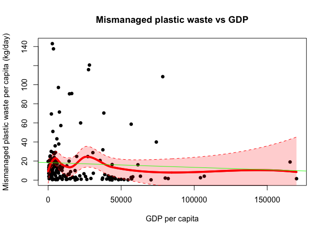<!-- -->

Plotting these plastic wastes against the GDP per capita suggests that
plastic waste tends to increase as GDP per capita increases. Still,
mismanaged plastic waste tends to decrease. Notice that the uncertainty
grows to the right of the plot, where the data are scarce. The local
regression curves appear to be relatively smooth; however, they are
still greatly influenced by extreme outliers in the data and heavily
right-skewed GDP data. Nevertheless, it is safe to link the GDPs per
capita and the two types of plastic waste.

## Bubble plot

-   Bubble plots are also obtained to explore the relationships between
    income status, regions, and population on the two types of plastic
    waste. The plot below shows that there is a pretty clear separation
    on the level of plastic waste generated per capita between different
    regions: Sub-Saharan Africa appears to form a cluster in the bottom
    left corner of the plot, indicating that this region has the lowest
    GDP per capita and produces low plastic waste per capita. The
    bubbles’ size for this region appears to be relatively small
    compared to others, indicating a small population size associated
    with this region. As we move along to the right of the plot, South
    Asia (i.e., purple bubbles) appears to be next to Sub- Saharan
    Africa.

-   Within South Asia, India seems to have the largest population size
    and a relatively high plastic waste generated per capita (19.88
    kilograms per capita) – the second highest after Bhutan (26.94
    kilograms per capita).This trend is followed by East Asia and the
    Pacific (i.e., red bubbles), in which mainland China appears to have
    the largest population size. Interestingly, China’s plastic waste
    per capita is distinctively lower than any other smaller country
    within this region (i.e., only 15.67 kilograms per capita compared
    to Micronesia (308.25 kilograms per capita)).

-   With a much lower population, Hong Kong has a much higher plastic
    waste than in China (i.e., the top right red bubble on top of the
    US, representing 163.45 kilograms of plastic waste per capita).
    Next, we have Latin America and the Caribbean (i.e., pale green
    bubbles) and the Middle East and North Africa (i.e., green bubbles),
    followed by a much higher GDP and plastic waste generated per capita
    in Europe and Central Asia (i.e., yellow bubbles) and lastly, North
    America (i.e., blue bubbles). Notice that the United Kingdom in
    Europe and the United States in the North America region have a
    comparably very high GDP per capita, and the plastic waste generated
    per capita, compared to other countries within the same region and
    in other areas.

## Plastic waste against GDP across regions

``` r
par(mfrow = c(1, 1))
plot(x=log10(plastic$GDP),
     y=plastic$PlasticWaste,
     col=rainbow(n = 7, alpha = 0.8),
     xlab='GDP', ylab='Plastic Waste (kg/day)', pch=16
     , main = "Plastic waste against GDP across regions")
```

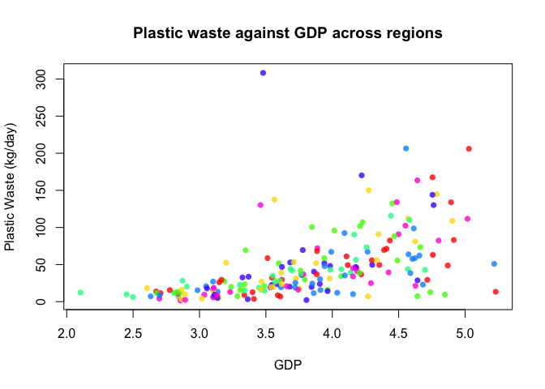<!-- -->

``` r
par(mfrow = c(1, 1))
symbols(y = plastic$PlasticWaste,
        x = log(plastic$GDP),
        bg = rainbow(n = 7, alpha = 0.8)[plastic$Region],
        fg = NA,
        circles = sqrt(plastic$Population),
        inches = 0.5,
        xlab = "log(GDP)",
        ylab = "Plastic Waste (kg/day)",
        xlim = c(2.5, 13),
        ylim = c(0, 350),
        main ="Plastic waste against GDP across regions" 
      
      )

legend(x = 'topleft',
       col = rainbow(n = 7, alpha = 0.9),
       pch = 16,
       bty = "n",
       legend = levels(plastic$Region))


# add labels CH, india, us, uk
text(x=log(plastic$GDP[plastic$Country=="China"]),
     y=plastic$PlasticWaste[plastic$Country=="China"],
     labels='CHINA', cex=0.8)

text(x=log(plastic$GDP[plastic$Country=="United States"]),
     y=plastic$PlasticWaste[plastic$Country=="United States"],
     labels='US', cex=0.8)
# UK
text(x=log(plastic$GDP[plastic$Country=="United Kingdom"]),
     y=plastic$PlasticWaste[plastic$Country=="United Kingdom"],
     labels='UK', cex=0.8)

# India
text(x=log(plastic$GDP[plastic$Country=="India"]),
     y=plastic$PlasticWaste[plastic$Country=="India"],
     labels='INDIA', cex=0.8)

text(x=log(plastic$GDP[plastic$Country=="Hong Kong SAR, China"]),
     y=plastic$PlasticWaste[plastic$Country=="Hong Kong SAR, China"],
     labels='HK', cex=0.8)
```

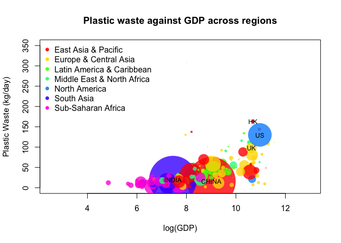<!-- -->

## Mismanaged PW against GDP across regions

``` r
symbols(y = plastic$MismanagedPW,
        x = log(plastic$GDP),
        bg = rainbow(n = 7, alpha = 0.75)[plastic$Region],
        fg = NA,
        circles = sqrt(plastic$Population),
        inches = 0.5,
        xlab = "(log) GDP",
        ylab = "Mismanaged Waste (kg/day)",
        main = "Mismanaged plastic waste against GDP across regions",
        xlim = c(2.5, 13),
        ylim = c(0, 145)
        
)

legend(x = 'topleft',
       col = rainbow(n = 7, alpha = 0.75),
       pch = 16,
       bty = "n",
       legend = levels(plastic$Region))
# add labels CH, india, us, uk
text(x=log(plastic$GDP[plastic$Country=="China"]),
     y=plastic$MismanagedPW[plastic$Country=="China"],
     labels='CHINA', cex=0.8)

text(x=log(plastic$GDP[plastic$Country=="United States"]),
     y=plastic$MismanagedPW[plastic$Country=="United States"],
     labels='US', cex=0.8)
# UK
text(x=log(plastic$GDP[plastic$Country=="United Kingdom"]),
     y=plastic$MismanagedPW[plastic$Country=="United Kingdom"],
     labels='UK', cex=0.8)

# India
text(x=log(plastic$GDP[plastic$Country=="India"]),
     y=plastic$MismanagedPW[plastic$Country=="India"],
     labels='INDIA', cex=0.8)
```

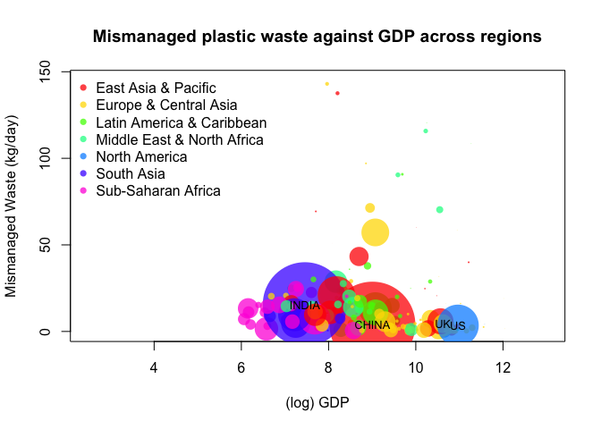<!-- -->

## Plastic waste against GDP across income status

Plotting a similar bubble plot but with grouped income status reveals a
pattern on the difference in the plastic waste generated: low- income
countries (i.e., red bubbles), which are identified to be in Sub-Saharan
Africa, tend to sit near the bottom of the plot due to low GDP per
capita and plastic waste per capita. This is followed by low-middle
income countries (i.e., green bubbles) such as India, high-middle income
countries (i.e., blue bubbles) such as China, and high-income countries
(i.e., purple bubbles) such as the United Kingdom and the United States.

``` r
symbols(y = plastic$PlasticWaste,
        x = log(plastic$GDP),
        bg = rainbow(n = 4, alpha = 0.8)[plastic$IncomeStatus],
        fg = NA,
        circles = sqrt(plastic$Population),
        inches = 0.5,
        xlab = "log(GDP)",
        ylab = "Plastic Waste (kg/day)",
        xlim = c(2.5, 13),
        ylim = c(0, 350),
        main ="Plastic waste against GDP across income status" 
        
)
levels(plastic$IncomeStatus) <- c('Low-income', "Low-middle income", "High-middle income", "High income")
legend(x = 'topleft',
       col = rainbow(n = 4, alpha = 0.9),
       pch = 16,
       bty = "n",
       legend = levels(plastic$IncomeStatus))

# add labels CH, india, us, uk
text(x=log(plastic$GDP[plastic$Country=="China"]),
     y=plastic$PlasticWaste[plastic$Country=="China"],
     labels='CHINA', cex=0.8)

text(x=log(plastic$GDP[plastic$Country=="United States"]),
     y=plastic$PlasticWaste[plastic$Country=="United States"],
     labels='US', cex=0.8)
# UK
text(x=log(plastic$GDP[plastic$Country=="United Kingdom"]),
     y=plastic$PlasticWaste[plastic$Country=="United Kingdom"],
     labels='UK', cex=0.8)

# India
text(x=log(plastic$GDP[plastic$Country=="India"]),
     y=plastic$PlasticWaste[plastic$Country=="India"],
     labels='INDIA', cex=0.8)
```

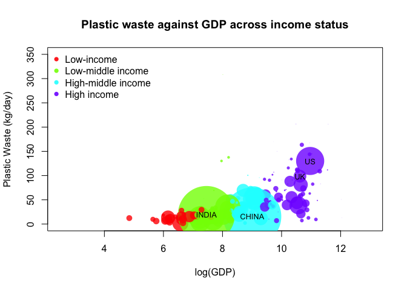<!-- -->

## Mismanaged plastic waste against GDP across income status

``` r
symbols(y = plastic$MismanagedPW,
        x = log(plastic$GDP),
        bg = rainbow(n = 4, alpha = 0.75)[plastic$IncomeStatus],
        fg = NA,
        circles = sqrt(plastic$Population),
        inches = 0.5,
        xlab = "(log) GDP",
        ylab = "Mismanaged Waste (kg/day)",
        main = "Mismanaged plastic waste against GDP across income status",
        xlim = c(2.5, 13),
        ylim = c(0, 145)
        
)

legend(x = 'topleft',
       col = rainbow(n = 4, alpha = 0.75),
       pch = 16,
       bty = "n",
       legend = levels(plastic$IncomeStatus))
# add labels CH, india, us, uk
text(x=log(plastic$GDP[plastic$Country=="China"]),
     y=plastic$MismanagedPW[plastic$Country=="China"],
     labels='CHINA', cex=0.8)

text(x=log(plastic$GDP[plastic$Country=="United States"]),
     y=plastic$MismanagedPW[plastic$Country=="United States"],
     labels='US', cex=0.8)
# UK
text(x=log(plastic$GDP[plastic$Country=="United Kingdom"]),
     y=plastic$MismanagedPW[plastic$Country=="United Kingdom"],
     labels='UK', cex=0.8)

# India
text(x=log(plastic$GDP[plastic$Country=="India"]),
     y=plastic$MismanagedPW[plastic$Country=="India"],
     labels='INDIA', cex=0.8)
```

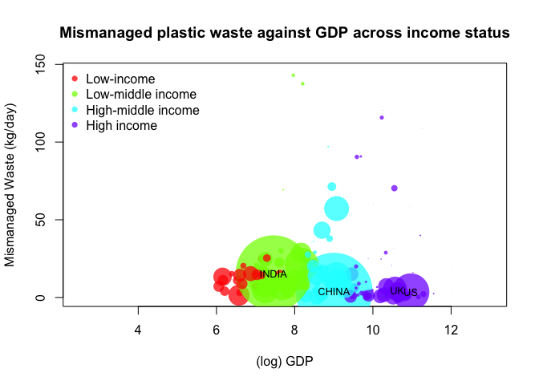<!-- -->

-   For the mismanaged plastic waste, the plot below shows a trend that
    high-income countries with a very high GDP per capita, such as the
    United States in North America region and the United Kingdom in the
    Europe region, have a very low mismanaged plastic waste generated
    per capita per day. Certain high-middle income countries such as
    China in the East Asia and Pacific region appear to have comparably
    well waste management systems and infrastructures.

-   Low-middle-income countries like India appear to have a relatively
    high mismanaged plastic waste per capita. Low- income countries in
    Sub-Saharan Africa have low values; however, it is noted that there
    are high missing values for the mismanaged plastic waste data in
    this region, which may influence the result.

# Conclusion

-   Regions of high-income countries with high GDP per capita tend to
    have higher plastic waste generated than the lower-income incomes
    with low GDP per capita

-   However, these regions tend to have lower mismanaged plastic waste
    that their counterparts potentially due to a better waste management
    system.

-   High urbanization further influences high plastic waste and low
    mismanaged plastic waste potentially due to an increased number of
    population living in the urban areas and better infrastructures and
    systems for waste management.
